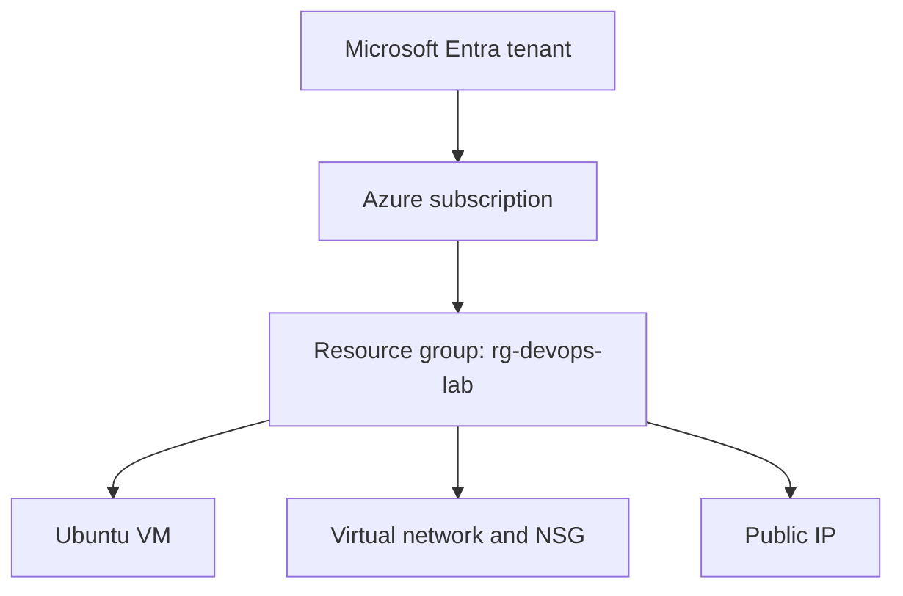
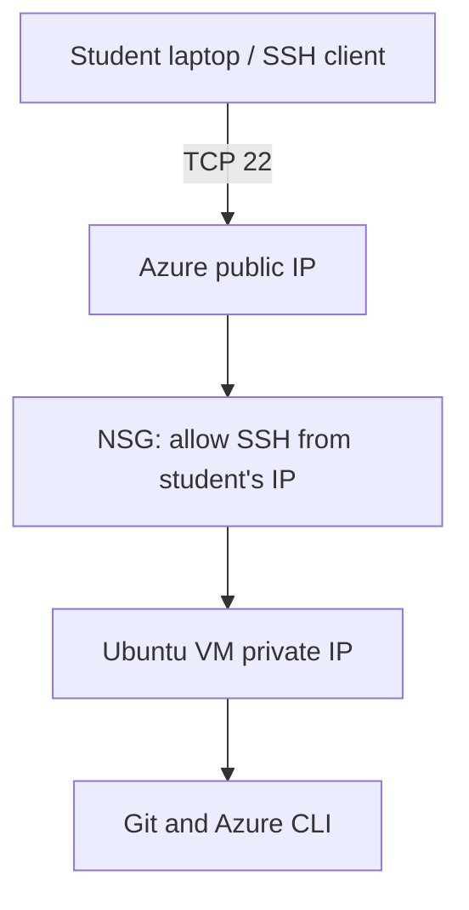
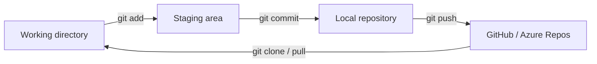
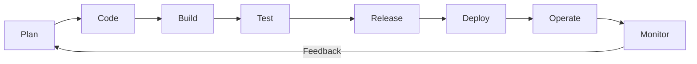
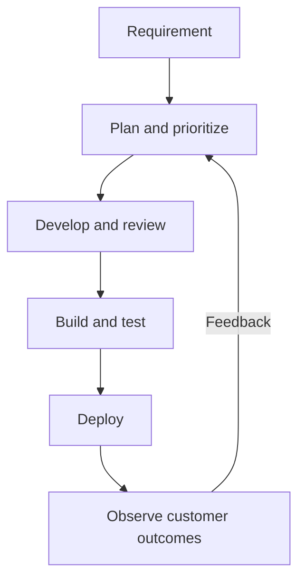
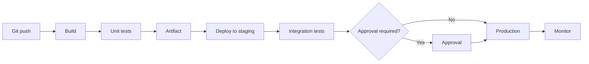
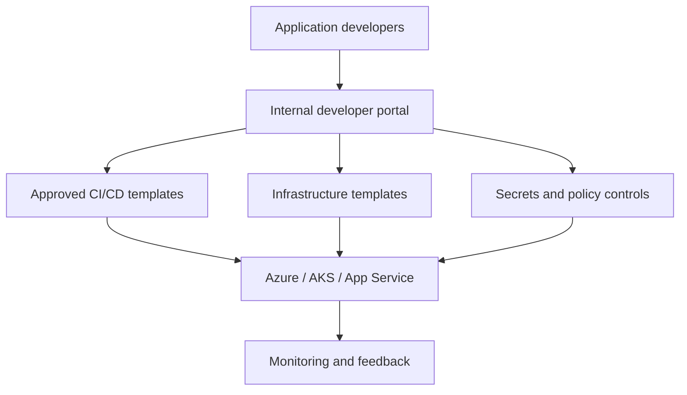

# Azure DevOps (AZ-400) — Modules 1 & 2

**Audience:** Beginners learning Azure, Linux, Git and DevOps  
**Goal:** Build a basic Azure development environment and understand modern software delivery.

> **Cost reminder:** Azure resources may incur charges. Check your subscription's current free-trial terms and delete lab resources when finished.

## Learning outcomes

By the end of these modules, students can:
- Create an Azure resource group and Ubuntu VM, then connect securely using SSH.
- Install Git and Azure CLI; use VS Code Remote - SSH.
- Perform common Linux and Git operations.
- Explain networking, IAM, the DevOps lifecycle and CI/CD.
- Describe DORA metrics, maturity models and platform engineering.
- Run a basic Python CI pipeline in Azure Pipelines.

---

# Module 1 — Environment Setup & DevOps Basics

## 1. Azure free trial and subscription setup

1. Visit [Azure Free Account](https://azure.microsoft.com/free/) and check eligibility and current offer terms.
2. Sign in and complete the required verification.
3. Open the [Azure Portal](https://portal.azure.com/).
4. Go to **Subscriptions** and confirm that your subscription is active.
5. Set a budget and cost alerts in **Cost Management** before starting labs.

**Key terms**

| Term | Meaning |
|---|---|
| Microsoft Entra ID | Identity and access management service |
| Subscription | Billing and resource-management boundary |
| Resource group | Logical container for related Azure resources |
| Region | Geographic location where Azure resources run |
| Azure RBAC | Assigns permissions at a particular scope |



### Lab: Create a resource group

Run in Azure Cloud Shell or a local terminal with Azure CLI installed:

```bash
az login
az account list --output table
# Select the intended subscription if you have more than one:
az account set --subscription '<SUBSCRIPTION_ID>'
az group create --name rg-devops-lab --location centralindia
az group show --name rg-devops-lab --output table
```

## 2. Azure Portal and IAM basics

Explore **Resource groups**, **Virtual machines**, **Virtual networks**, **Subscriptions**, **Monitor**, **Activity log**, and **Cost Management**.

| Azure RBAC role | Typical permissions |
|---|---|
| Owner | Manage resources and assign Azure RBAC roles |
| Contributor | Manage resources but cannot assign Azure RBAC roles |
| Reader | View resources |
| Virtual Machine Contributor | Manage VMs, subject to related resource permissions |

**Lab:** Open `rg-devops-lab` → **Access control (IAM)** → **View my access**. Review existing role assignments. Follow least privilege; do not grant broad roles merely for practice.

## 3. Create a Linux VM and connect using SSH

**Suggested lab configuration** (subject to availability and pricing):

| Setting | Example |
|---|---|
| Resource group | `rg-devops-lab` |
| VM name | `vm-devops` |
| Image | Ubuntu Server 24.04 LTS |
| Size | Standard_B1s, where available |
| Authentication | SSH public key |
| Username | `azureuser` |
| SSH access | TCP 22 from **your public IP only** |

**Portal steps:** Virtual machines → Create → Azure virtual machine → choose settings above → configure networking and SSH source restriction → Review + create. Save the generated private key securely.



Connect from macOS/Linux (replace the filename and IP with your values):

```bash
chmod 400 ~/Downloads/vm-devops_key.pem
ssh -i ~/Downloads/vm-devops_key.pem azureuser@<PUBLIC_IP>
whoami
hostname
cat /etc/os-release
```

For Windows, use Windows Terminal/OpenSSH or VS Code Remote - SSH. Do not commit private keys to Git.

## 4. Install Git, VS Code and Azure CLI

On Ubuntu:

```bash
sudo apt update
sudo apt install -y git curl wget unzip
git --version
```

Install Azure CLI using the [official Linux installation instructions](https://learn.microsoft.com/en-us/cli/azure/install-azure-cli-linux). On supported Ubuntu versions, Microsoft's installer is an option; inspect scripts before executing them:

```bash
curl -fsSL https://aka.ms/InstallAzureCLIDeb -o install-azure-cli.sh
less install-azure-cli.sh
sudo bash install-azure-cli.sh
az version
az login
```

Install [VS Code](https://code.visualstudio.com/) **on your local computer**, add the **Remote - SSH** extension, and connect to the VM using its SSH configuration.

## 5. Basic Linux commands

| Topic | Commands |
|---|---|
| Navigation | `pwd`, `ls -la`, `cd` |
| Files/directories | `touch`, `cat`, `cp`, `mv`, `mkdir`, `rm` |
| Permissions | `ls -l`, `chmod`, `chown` |
| Processes | `ps aux`, `top`, `kill` |
| Services/logs | `systemctl`, `journalctl` |
| Network | `ip addr`, `ss -tuln`, `curl` |
| Resources | `df -h`, `free -h` |

**Practice:**

```bash
mkdir -p ~/devops-practice
cd ~/devops-practice
echo 'Hello DevOps' > app.txt
cat app.txt
ls -l app.txt
chmod 640 app.txt
ps aux | head
df -h
free -h
```

Explain `r=4`, `w=2`, `x=1`; owner, group and others; processes versus services; and why production permissions should be restrictive.

## 6. Networking basics: VNet, NSG, ports and IPs

- **VNet:** Isolated Azure network; **subnet:** address range inside a VNet.
- **Private IP:** Used inside the VNet or connected networks.
- **Public IP:** Allows public internet connectivity when associated with a suitable resource.
- **NSG:** Stateful rules controlling permitted inbound and outbound traffic.

| Port | Protocol | Example |
|---|---|---|
| 22 | TCP | SSH |
| 80 | TCP | HTTP |
| 443 | TCP | HTTPS |
| 3389 | TCP | RDP |
| 8080 | TCP | Development application |

**Lab: Host a test page.** First configure an NSG inbound rule permitting TCP 80 for the intended test source. Then run:

```bash
sudo apt install -y nginx
sudo systemctl enable --now nginx
echo '<h1>Welcome to Azure DevOps Lab</h1>' | sudo tee /var/www/html/index.html
curl http://localhost
```

Visit `http://<PUBLIC_IP>` from your browser. For a production workload, use HTTPS and minimize public exposure.

## 7. Git basics: clone, commit, push and branch



**Local repository lab:**

```bash
git config --global user.name 'Student Name'
git config --global user.email 'student@example.com'
mkdir ~/git-practice && cd ~/git-practice
git init -b main
echo '# First DevOps Project' > README.md
git add README.md
git commit -m 'Initial commit'
git switch -c feature/update-readme
echo 'Practicing Git branches' >> README.md
git add README.md
git commit -m 'Update README'
git switch main
git merge feature/update-readme
git log --oneline --graph --all
```

Create an **empty** GitHub or Azure Repos repository, then:

```bash
git remote add origin <REPOSITORY_URL>
git push -u origin main
# On another machine, clone the same repository:
git clone <REPOSITORY_URL>
```

Authenticate using your provider's supported SSH or credential-manager flow; do not put passwords or tokens into repository URLs.

## 8. DevOps lifecycle



| Stage | Typical Azure or related tool |
|---|---|
| Plan | Azure Boards |
| Code | Azure Repos / GitHub |
| Build and test | Azure Pipelines |
| Package | Azure Artifacts / Azure Container Registry |
| Release and deploy | Azure Pipelines |
| Operate and monitor | Azure Monitor / Application Insights |

**Discussion:** Which stages benefit from automation, and where might approvals still be necessary?

---

# Module 2 — DevOps Foundations

## 1. DevOps principles and culture

DevOps is a combination of **culture, practices and tools** that helps teams deliver and operate software collaboratively. Introduce **CALMS**:

- **Culture:** Shared responsibility and collaboration.
- **Automation:** Repeatable builds, tests, provisioning and deployment.
- **Lean:** Reduce handoffs, queues and waste.
- **Measurement:** Track delivery performance and service health.
- **Sharing:** Share knowledge, feedback and lessons learned.

**Activity:** Compare a manual release with a pipeline containing code review, tests, security checks, approvals and deployment.

## 2. Lifecycle and value stream

A value stream maps the journey from an idea to customer value:



Explain **lead time**, **processing time**, **waiting time**, **handoffs**, **rework** and **bottlenecks**. Have students map a sample change from request to production and mark every waiting period.

## 3. CI/CD concepts

| Concept | Definition |
|---|---|
| Continuous Integration (CI) | Integrate changes frequently and automatically build/test them |
| Continuous Delivery | Keep validated software in a releasable state; production release may require a decision |
| Continuous Deployment | Automatically release every change that passes the required checks |
| Pipeline | Automated stages and jobs used to validate and deliver software |
| Artifact | Versioned output of a build |



### Mini lab: Python CI in Azure Pipelines

Add these files to an Azure Repos or GitHub repository:

**`app.py`**

```python
def greeting(name):
    return f"Hello, {name}!"

if __name__ == "__main__":
    print(greeting("DevOps"))
```

**`test_app.py`**

```python
from app import greeting


def test_greeting():
    assert greeting("DevOps") == "Hello, DevOps!"
```

**`azure-pipelines.yml`**

```yaml
trigger:
  - main

pool:
  vmImage: ubuntu-latest

steps:
  - task: UsePythonVersion@0
    inputs:
      versionSpec: '3.12'
    displayName: 'Use Python 3.12'

  - script: |
      python -m pip install --upgrade pip
      python -m pip install pytest
      python -m pytest -v
    displayName: 'Run unit tests'

  - task: PublishPipelineArtifact@1
    inputs:
      targetPath: '$(Build.SourcesDirectory)'
      artifact: 'source'
    displayName: 'Publish source artifact'
```

In Azure DevOps, create a project → **Pipelines** → **New pipeline** → select the repository → **Existing Azure Pipelines YAML file** → run it. This example uses a Microsoft-hosted Ubuntu agent; confirm hosted-agent availability and parallel-job eligibility for your organization. Publishing the entire source directory is a teaching shortcut, not a recommended production packaging strategy.

## 4. DORA metrics

| Metric | Measures |
|---|---|
| Change lead time | Time from code commit to production deployment |
| Deployment frequency | How often deployments reach production |
| Failed deployment recovery time | Time to recover from failed deployments |
| Change fail rate | Proportion of deployments requiring immediate remediation |
| Deployment rework rate | Proportion of deployments that are unplanned work caused by production incidents |

The original four DORA metrics are frequently taught in introductory courses. Newer DORA guidance also includes **deployment rework rate**. **MTTR** (mean time to recovery/restore) is a related operational measure; specify the definition used in any exercise.

**Example exercise:** A team deploys 20 times in one month and 3 deployments require remediation. Calculate change fail rate: `3 / 20 × 100 = 15%`. Ask students to distinguish a metric from a target: no single number is universally appropriate for every team.

## 5. DevOps maturity levels

The following is an **illustrative teaching model**, not an official certification rating:

| Level | Typical characteristics |
|---|---|
| Initial | Manual deployments; teams work separately |
| Developing | Git and some repeatable scripts |
| Defined | Standard CI/CD and automated tests |
| Measured | Observability, delivery metrics and security checks |
| Optimizing | Continuous improvement and developer self-service |

**Activity:** Describe the next two improvements for a team currently deploying manually every month.

## 6. Platform engineering overview

Platform engineering builds reusable **internal developer platforms (IDPs)** so application teams can provision, deploy and observe software through supported self-service workflows.



Introduce **golden paths**, service catalogs, infrastructure templates, guardrails, developer experience and the difference between a platform team and an application team.

## 7. DevOps toolchain

| Area | Example tools |
|---|---|
| Planning | Azure Boards, Jira |
| Source control | Git, Azure Repos, GitHub |
| CI/CD | Azure Pipelines, GitHub Actions, Jenkins |
| Artifact management | Azure Artifacts, Azure Container Registry |
| Infrastructure as Code | Terraform, Bicep |
| Configuration management | Ansible |
| Containers and orchestration | Docker, Kubernetes, AKS |
| Security | Defender for Cloud, Trivy, SonarQube |
| Monitoring | Azure Monitor, Application Insights, Prometheus, Grafana |
| GitOps | Argo CD, Flux |

**Activity:** Choose tools for a Python web application that requires source control, tests, container deployment, infrastructure provisioning and monitoring.

## 8. AZ-400 exam overview

[Official AZ-400 exam page](https://learn.microsoft.com/en-us/credentials/certifications/exams/az-400/) · [Microsoft certification page](https://learn.microsoft.com/en-us/credentials/certifications/devops-engineer/)

Broad study areas include:
- Processes and communications
- Source control strategy
- Build and release pipelines
- Security and compliance
- Instrumentation and monitoring

**Important:** Microsoft can update the exam's measured skills, percentages and certification prerequisites. Check the current official study guide before scheduling the exam.

---

# Final hands-on assignment

**Scenario:** Set up a simple development workflow for a Python application on Azure.

- [ ] Verify an active Azure subscription and create a cost budget.
- [ ] Create `rg-devops-lab` and an Ubuntu VM.
- [ ] Restrict SSH to your IP and connect using a key.
- [ ] Install Git and Azure CLI.
- [ ] Create a GitHub or Azure Repos repository.
- [ ] Commit `app.py`, `test_app.py` and `azure-pipelines.yml`.
- [ ] Create a feature branch and merge it into `main`.
- [ ] Run the Azure Pipeline and inspect its test results.
- [ ] Explain the Plan → Code → Build → Test → Deploy → Monitor lifecycle.
- [ ] Document one potential bottleneck and one automation improvement.
- [ ] Remove unused lab resources to avoid charges.

**Submission:** Repository link, pipeline run screenshot, VM/SSH verification screenshot and a short architecture diagram. Never submit private keys, access tokens or passwords.

## Cleanup

**Warning:** This command permanently deletes the resource group and **all resources inside it**. Run it only if `rg-devops-lab` contains disposable lab resources:

```bash
az group delete --name rg-devops-lab --yes
```

Git repositories and Azure DevOps projects are separate from the Azure resource group and must be cleaned up separately if no longer needed.

## Official learning references

- [Azure documentation](https://learn.microsoft.com/en-us/azure/)
- [Azure CLI installation](https://learn.microsoft.com/en-us/cli/azure/install-azure-cli)
- [Azure RBAC](https://learn.microsoft.com/en-us/azure/role-based-access-control/overview)
- [Azure Pipelines](https://learn.microsoft.com/en-us/azure/devops/pipelines/)
- [Git documentation](https://git-scm.com/doc)
- [DORA](https://dora.dev/)
- [AZ-400](https://learn.microsoft.com/en-us/credentials/certifications/exams/az-400/)
